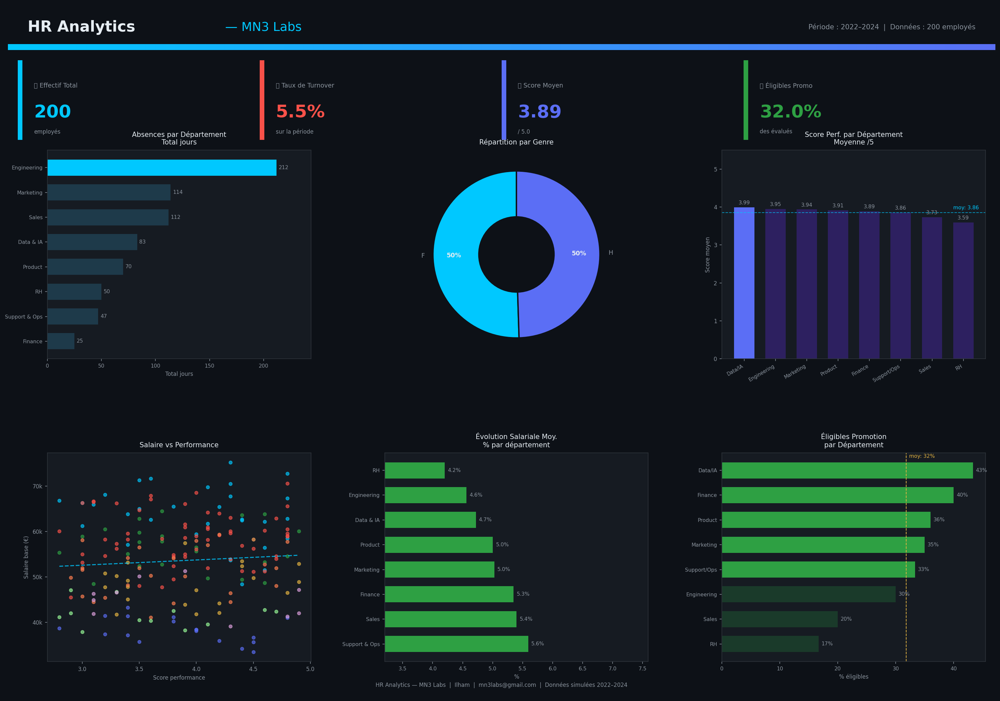

# HR Analytics Portfolio — MN3 Labs

> **Projet portfolio Data Analyst** — Analyse complète des données RH d'une entreprise tech fictive (200 employés, 2022–2024)



---

## Objectif

Démontrer une maîtrise end-to-end du cycle d'analyse de données RH :
génération de données → exploration → validation → SQL → analyse → visualisation → dashboard interactif.

---

## Structure du projet

```
hr-analytics-portfolio/
├── data/
│   ├── employees.csv        # 200 employés (profils, départements, contrats)
│   ├── performance.csv      # Évaluations trimestrielles 2022–2024
│   ├── absences.csv         # Historique des absences
│   └── salaries.csv         # Salaires, bonus et évolutions
│
├── queries/
│   └── hr_queries.sql       # 5 requêtes SQL analytiques (SQLite)
│
├── outputs/
│   ├── visualizations/
│   │   ├── 01_heatmap_correlation.png
│   │   ├── 02_absenteisme_departement.png
│   │   ├── 03_evolution_performance.png
│   │   ├── 04_scatter_salaire_performance.png
│   │   └── 05_pyramide_anciennete.png
│   ├── dashboard.html           # Dashboard interactif (ouvrir dans le navigateur)
│   └── dashboard_preview.png   # Aperçu statique du dashboard
│
└── README.md
```

---

## Stack technique

| Outil | Usage |
|-------|-------|
| **Python** · pandas · numpy | Génération et exploration des données |
| **matplotlib** · seaborn | Visualisations statiques |
| **SQLite** | Requêtes analytiques |
| **HTML** · CSS · Chart.js 4.5 | Dashboard interactif |

---

## Données

Les données sont **entièrement fictives** et générées programmatiquement pour simuler une entreprise tech de 200 employés avec :

- 8 départements : Engineering, Data & IA, Product, Sales, Marketing, Support & Ops, RH, Finance
- Période couverte : T1 2022 → T1 2024 (9 trimestres)
- Prénoms et noms français réalistes
- Cohérence référentielle entre les 4 fichiers (clés `employee_id`)

---

## Analyses réalisées

### 1. Exploration & Qualité des données
- Profil des 4 CSV : distributions, valeurs nulles, anomalies
- Validation de l'intégrité référentielle inter-fichiers
- Détection d'outliers salariaux par méthode IQR

### 2. Requêtes SQL (SQLite)
- Taux de turnover par département et période
- Corrélation performance / salaire
- Top 10 absences vs performance
- Promotions par genre et ancienneté
- Coût salarial total par département

### 3. Analyse RH
- Meilleurs et moins bons départements (performance, absence, rétention)
- Corrélation ancienneté / performance (Pearson manuel)
- Saisonnalité des absences (pics janvier & juillet)
- Scoring composite de risque de turnover (0–10)

### 4. Visualisations Python
- Heatmap de corrélation des variables numériques
- Bar chart absentéisme par département
- Line chart évolution des scores de performance
- Scatter plot salaire vs performance par département
- Pyramide des effectifs par ancienneté

---

## Dashboard interactif

Ouvrir `outputs/dashboard.html` dans un navigateur moderne.

**Fonctionnalités :**
- 🎛️ Filtres dynamiques : département, type de contrat, éligibilité promotion
- 📊 6 graphiques interactifs Chart.js (hover, tooltips)
- ⚠️ Section alertes RH : 19 profils à risque de turnover identifiés
- 📋 Tableau employés triable par colonne
- 🔍 Onglet **Analyse & Conclusions** : synthèse, recommandations stratégiques, tableau comparatif par département

**Design :** dark theme · couleurs `#00C8FF` (cyan) & `#5B6EF5` (violet)

---

## Principaux enseignements

| Indicateur | Valeur |
|-----------|--------|
| Score de performance moyen | **3.89 / 5** |
| Taux de turnover | **5.5%** |
| Taux d'absentéisme global | **1.57%** |
| Employés éligibles à la promotion | **32%** |
| Profils à risque élevé de départ | **19 employés** |
| Masse salariale totale | **11.26 M€** |

**Meilleurs départements :** Data & IA (3.96), Engineering (3.95)

**Départements prioritaires :** RH (3.59, salaire moyen 41k€), Sales (3.75, absentéisme 1.98%)

---

## Recommandations stratégiques

1. 🔴 **Plan de rétention** pour les 19 profils à risque → économie estimée ~760k€
2. 🔴 **Revalorisation salariale** RH (+8–12%) et Support & Ops
3. 🟡 **Programme de promotion** Sales & RH (taux actuels : 30% et 16.7%)
4. 🟡 **Plan bien-être** Marketing & Sales (absentéisme au-dessus de la moyenne)
5. 🟢 **Capitaliser** sur les bonnes pratiques Data & IA et Engineering

---

## Auteur

**Ilham** · [mn3labs@gmail.com](mailto:mn3labs@gmail.com) · MN3 Labs

---

*Données fictives générées à des fins de démonstration portfolio.*
